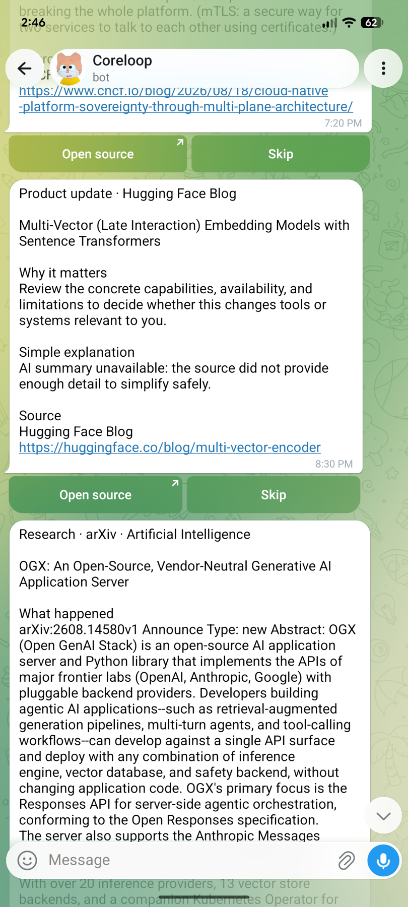
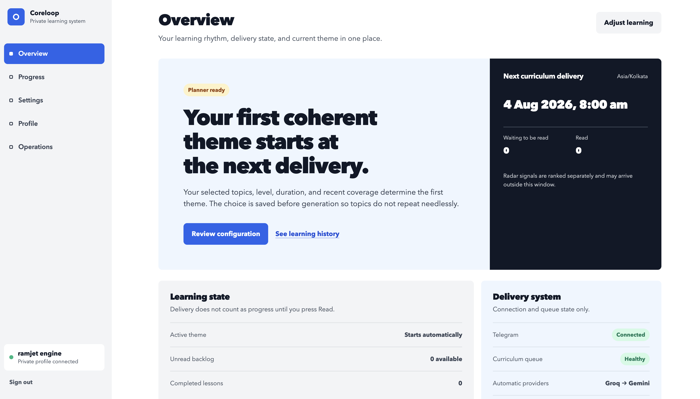
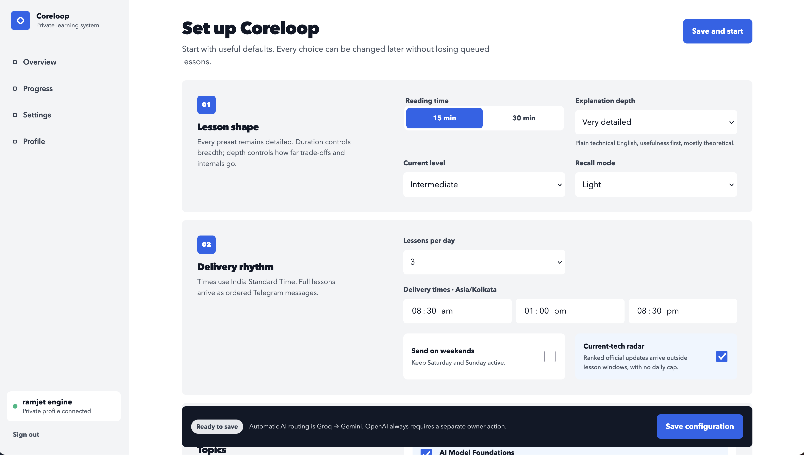

# Coreloop

  <strong>A private, self-hosted learning and news loop that arrives in Telegram.</strong>
   
  Configure the rhythm in a focused web app. Let Coreloop handle planning,
  sourcing, scheduling, retries, and delivery.

  <code>Telegram-first</code>
  &nbsp;·&nbsp;
  <code>Invite-only</code>
  &nbsp;·&nbsp;
  <code>Source-backed</code>
  &nbsp;·&nbsp;
  <code>AI-optional news</code>
  &nbsp;·&nbsp;
  <code>Built for free tiers</code>

<table>
  <tr>
    <td width="30%" valign="top">
      
      

        <strong>Delivery surface</strong> · Lessons and fresh, sourced updates arrive where you already pay attention.
      

    </td>
    <td width="70%" valign="top">
      
      

        <strong>Control surface</strong> · See the current theme, next delivery, Telegram connection, queue health, and provider state.
      

       
      

        <strong>The web app manages the loop; Telegram is where the loop is consumed.</strong>
        Coreloop does not ask you to maintain another feed or learning dashboard.
        Set your preferences once, adjust them whenever needed, and receive the
        useful part directly.
      

    </td>
  </tr>
</table>

## Everything is manageable from the UI

The setup and settings screens control lesson length and depth, current level,
topics, daily delivery times, weekend delivery, recall, and News Radar cadence.
The profile area handles Telegram and privacy controls. Owner Operations exposes
queue health, failure details, invitations, and manual delivery checks.

  Useful defaults make setup quick, while each profile keeps an independent rhythm and topic mix.

## One continuous loop

1. **Choose what matters.** Select subjects, depth, reading time, delivery
   windows, weekends, recall, and how much news you want.
2. **Coreloop plans and watches.** It continues coherent lesson themes while
   polling, ranking, and balancing trusted news sources.
3. **Telegram delivers the result.** Complete lessons and individual sourced
   news items arrive as actionable messages—not as another inbox to check.
4. **Light feedback improves the next pass.** Read and Skip signals shape future
   delivery without blocking the durable queue.

## What ships with Coreloop

- **Connected lessons:** detailed 15- or 30-minute material that develops a
  theme over time instead of jumping between random topics.
- **News Radar:** recent updates from RSS and Atom, Hacker News, Stacker News,
  GitHub Releases, official engineering blogs, research feeds, sitemaps, and
  selected public social feeds.
- **Source-first delivery:** every news item retains its original source, stale
  items are rejected, and high-volume source families cannot dominate a batch.
- **Graceful AI fallback:** Groq and Gemini can generate lessons and simplify
  news, while deterministic news ingestion and delivery continue when AI is
  unavailable.
- **Durable scheduling:** Turso stores jobs, leases, retries, provider state,
  and delivery progress so restarts do not erase the loop.
- **Private access:** members join through single-use invitations and sign in
  with Telegram. There is no public signup or password database.

The starter catalogue focuses on software engineering, applied AI, cloud,
security, reliability, product, communication, sales, and Bitcoin. Topics and
sources are data-driven, so the same delivery system can support a different
field without being rebuilt.

## Built to run itself

| Concern              | Coreloop's approach                                                         |
| -------------------- | --------------------------------------------------------------------------- |
| Web control surface  | Responsive Next.js app for setup, progress, privacy, and operations         |
| Application backend  | Go services for authentication, planning, ranking, jobs, and delivery       |
| Primary destination  | Telegram Bot API for complete lessons and one-message-per-item news         |
| Durable state        | Turso/libSQL for profiles, content, schedules, queues, and delivery records |
| Scheduling           | One QStash schedule wakes a durable chronological queue                     |
| Automatic AI routing | Groq first, Gemini second; OpenAI is never an automatic fallback            |
| No-AI behavior       | Source ingestion, ranking, and deterministic news delivery keep running     |

## Run your own loop

Start with the [local development guide](docs/local-development.md). It covers
prerequisites, environment variables, database migrations, and release checks.

Coreloop is designed around zero-mandatory-spend service tiers: Vercel Hobby,
Turso Free, QStash Free, the Telegram Bot API, and free Groq or Gemini quotas.
Each provider still controls its own availability and limits.

> [!IMPORTANT] Keep credentials in an untracked local environment file or your
> hosting provider's secret store. Never put a secret in a `NEXT_PUBLIC_*`
> variable.
