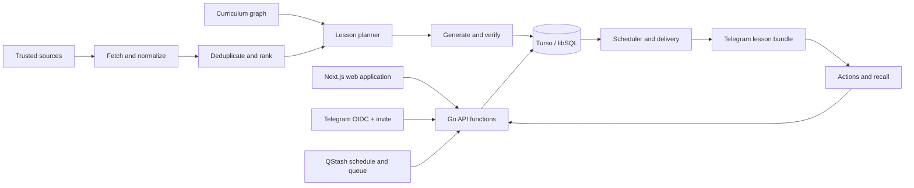

# System design

Last updated: 2026-08-03

## Design posture

The first version is a hosted, small multi-user product for the primary user and
friends. Deploy a simple Next.js frontend and modular Go API functions in one
Vercel Hobby project, backed by one Turso relational database. This preserves a
clear frontend/backend boundary without requiring a paid or always-on server.
Do not begin with microservices, Kafka, Kubernetes, a vector database, or an
autonomous multi-agent architecture.

The architecture should become more complex only when observed load or product
requirements justify it.

## System flow

## Components

### Web frontend

Provides onboarding, the current theme and next-delivery summary, the learning
plan, progress, profile configuration, Telegram connection, delivery settings,
and account/data controls. It is a small responsive control surface rather than
a lesson renderer. It consumes the backend API and never receives database or
provider credentials.

### Authentication and profile service

Consumes a single-use invite, authenticates through Telegram OIDC with PKCE,
validates the ID token and nonce, requests `telegram:bot_access`, creates the
application user from the verified Telegram subject, and enforces ownership for
every profile, preference, assignment, interaction, and progress record. It does
not implement email signup, passwords, or a separate bot-connection code.

### Backend API

Owns authorization, profile validation, learning-plan state, stored lesson
bundles, interaction recording, Telegram callbacks, job endpoints, and narrow
administrative operations. Go modules remain separate from the Next.js UI even
though both deploy in the same Vercel project.

### Source ingester

Polls the initial allowlist of feeds, changelogs, APIs, and release pages. It
normalizes timestamps and URLs, records retrieval failures, and keeps source
provenance.

### Deduplicator and ranker

Combines exact URL matching, normalized title matching, release identifiers, and
simple similarity only when necessary. The first ranking model should use
visible deterministic weights.

### Curriculum planner

Chooses or continues an active theme block, then selects the next eligible
lesson from prerequisites, completion state, recall results, target-role
priorities, requested duration, requested depth, and daily schedule. It cannot
jump to an unrelated theme merely to fill a slot.

### Content generator

Uses an LLM to explain and transform selected evidence, not to invent the source
material. It should return a validated structured object containing sections,
claims, citations, questions, estimated reading time, and uncertainty.

### AI provider router

Accepts one provider-independent generation request and invokes a Groq, Gemini,
or OpenAI adapter. Automatic routing tries Groq's free quota and then Gemini's
free quota. OpenAI is disabled unless the owner explicitly enables it. The
router applies usage accounting and normalized error handling without leaking
provider response shapes into the curriculum or delivery modules.

### Verification step

Checks required fields, URLs, dates, citation coverage, unsupported numerical
claims, message size, and prohibited content patterns. A failed result receives
one corrective regeneration request. If claims still cannot be verified, the
lesson can ship only with a prominent warning and separated verified,
interpretive, and unverified sections.

### Delivery scheduler

Calculates delivery from the user's time zone, quiet hours, weekdays, backlog,
and pause state. Routine lessons are generated and stored before their delivery
window. Each bundle and part has an idempotency key so a retried job can resume
without resending text that Telegram already accepted.

### Telegram bundle delivery

Telegram OIDC both authenticates the user and requests permission for the linked
bot to send direct messages. The adapter sends pre-generated lesson parts
serially, records the provider message ID of each part, handles bounded retries
and rate limits, and receives inline-button or message responses through a
webhook. Telegram-specific formatting and limits remain outside curriculum
logic.

## Database decision

Turso/libSQL is the selected MVP database. Its official Platform API can
support database-per-user multi-tenancy, but that isolation model is unnecessary
for the first friends-and-family version. Use one shared relational database and
put `user_id` on every user-owned record. This keeps joins, migrations,
analytics, scheduling, and backups understandable.

Turso credentials stay on the backend. They do not provide application-user
authentication by themselves. The application still needs an authentication
system and backend authorization checks.

References:

- [Turso Platform API and multi-tenant options](https://docs.turso.tech/api-reference/introduction)
- [Turso API authentication](https://docs.turso.tech/api-reference/authentication)
- [Turso free plan](https://turso.tech/pricing)

## Suggested data model

### `users`

Stores the Telegram OIDC subject, status, English locale, creation date, and
account-level data. No email address or password is required.

### `invites`

Stores a hashed single-use invite token, creator, expiry, consumed timestamp,
and consuming user. Raw invite tokens are never stored.

### `learning_profiles`

Stores current experience, goals, target roles, preferred explanation style,
default time zone, and current active learning path.

### `learning_preferences`

Stores lesson duration, explanation depth, lessons per day, radar frequency,
recall mode, weekend choice, Telegram bundle mode, and quiet-period settings.

### `delivery_schedules`

Stores local delivery days, named or explicit time slots, time zone, active
range, and pause state.

### `delivery_destinations`

Stores the Telegram chat identifier, connection timestamp, status, and enabled
state. Sensitive destination data should be minimized.

### `user_topic_preferences`

Stores selected tracks, priorities, excluded subjects, familiarity, and feedback
weights for one user.

### `topics`

Stores the curriculum topic, lane, difficulty, prerequisites, learning
objectives, and status.

### `learning_paths`

Stores the ongoing, versioned path created for a profile. It has no target end
date or terminal lesson count.

### `theme_blocks`

Stores a coherent multi-session theme, objectives, planned lesson sequence,
estimated sessions, active state, and completion criteria.

### `sources`

Stores the publisher, canonical URL, source tier, fetch method, trust notes, and
polling schedule.

### `source_items`

Stores a fetched publication or release with timestamps, canonical content
hash, extracted evidence, and cluster identifier.

### `lessons`

Stores the generated lesson, type, topic, source items, version, reading-time
estimate, verification state, and generation cost.

### `lesson_parts`

Stores the immutable ordered Telegram parts for one verified lesson version,
including sequence number, total part count, rendered text, character count, and
formatting mode. A published lesson version is never re-chunked during a retry.

### `lesson_assignments`

Connects a lesson or generated variant to one user, theme, schedule position,
completion state, and personalization reason.

### `deliveries`

Stores the intended time, actual time, bundle status, attempt count, idempotency
key, and error. Quota-blocked work remains pending rather than being discarded.

### `delivery_parts`

Stores one row per Telegram part with its part idempotency key, provider message
ID, attempt count, delivery state, timestamps, and last error. This makes partial
bundle recovery explicit.

### `interactions`

Stores button actions, completion, relevance feedback, answer text, correctness,
and timestamps.

### `reviews`

Stores the recall item, due time, result, and next review time.

### `decisions`

Stores significant product or architecture decisions and their evidence. This
turns the project into visible product-engineering work.

### `provider_runs`

Stores provider, model identifier, prompt version, schema version, latency,
input tokens, output tokens, provider-reported cache reads and writes, cost
estimate, validation result, and error. It must not store provider API keys.

### `prompt_versions`

Stores immutable shared instruction, schema, and prompt-compiler versions with
checksums and evaluation status. Production jobs reference an approved version.

### `cache_entries`

Stores typed cache keys, value references, creation time, source and prompt
versions, verification state, and optional expiry. Large lesson bodies remain in
their domain tables rather than being duplicated into a generic cache blob.

### `job_queue`

Stores generation, delivery, radar, and recovery jobs with due time, lease,
attempt count, provider state, first-come sequence, and error. Persisted jobs are
the source of truth; QStash is a wake-up and delivery mechanism, not the only
record of pending work.

## Scheduling

- Use one QStash schedule to invoke a signed scheduler endpoint approximately
  every ten minutes. Exact-minute delivery is not a product requirement.
- Poll fast-moving sources every one to four hours as appropriate.
- Generate detailed radar briefings outside curriculum slots.
- Default to three per-user curriculum slots at 09:00, 14:00, and 21:00 in
  `Asia/Kolkata`, with weekends disabled.
- Generate and deliver according to each profile's local days, duration, depth,
  lesson count, quiet hours, weekend choice, and active theme.
- Radar does not consume curriculum lesson slots and has no daily cap after a
  candidate clears the relevance threshold.
- Recalculate due reviews after every answer.
- Place at most one due recall question inside a later scheduled lesson.
- Process due generation work first-come, first-served across all users; the MVP
  has no reserved quota or user-priority system.
- Continue scheduling when earlier lessons remain unread.
- When quota later recovers, process every blocked job chronologically and send
  the recovered backlog rather than dropping it.

Fetching frequently does not imply notifying frequently. Ingestion freshness and
human attention are separate concerns.

## Deterministic code versus AI

Use deterministic code for:

- Scheduling and time zones
- Fetching, hashes, URLs, versions, and timestamps
- Required-field and size validation
- Delivery idempotency and retries
- Source allowlists and hard filters
- Progress and recall state
- User authorization, configuration bounds, and theme continuity

Use an LLM for:

- Explaining technical material at the requested depth
- Mapping new material to curriculum concepts
- Producing examples and recall questions
- Clustering ambiguous but related items
- Drafting a concise current-signal card from supplied evidence

The model should not be the database, scheduler, source of publication dates, or
final authority on whether a claim is supported.

## AI efficiency design

- Keep generation stateless and assemble a typed compact context rather than
  resending a learner's full profile, history, chat, or previous lessons.
- Put one stable, versioned instruction prefix before a small structured dynamic
  payload so provider prefix caching can work where supported.
- State every instruction once. Prompt compression removes duplication and
  irrelevant context; it never removes a lesson requirement.
- Retrieve only evidence passages relevant to the current objectives. Do not
  send complete source pages.
- Apply provider-aware input and output token budgets before calling a model.
- Cache sources, normalized evidence, rankings, compatible verified lessons,
  compiled prompt inputs, and Telegram rendering with versioned content hashes.
- Use deterministic Go and SQL for filtering, ranking arithmetic,
  deduplication, scheduling, validation, and chunking.
- Make one model call normally and at most one corrective call. Do not hedge
  across providers or use an LLM judge in the delivery path.
- Measure input, output, provider-cached tokens, application cache hits, retry
  reasons, latency, and evaluation quality. Keep a prompt optimization only when
  representative lessons remain correct and complete.

## Multi-provider AI contract

Groq, Gemini, and OpenAI should implement one application-owned interface such as
`generateLesson(request) -> normalizedLesson`. The shared request contains:

- Versioned system instructions and content policy
- Learner profile and active theme context
- Learning objectives and prerequisites
- Target reading time and explanation depth
- Source evidence and provenance
- The common JSON output schema
- Required evaluation and citation rules

Each adapter translates that contract to its provider's current API. A shared
prompt does not mean assuming identical API parameters or capabilities.

The normalized result contains content sections, claims, citations, questions,
reading-time estimate, provider usage, and validation metadata. Application code
validates semantic requirements even when a provider guarantees syntactically
valid structured output.

Automatic routing is ordered and deliberately asymmetric:

1. Try Groq while the configured project remains on its free quota.
2. On a quota-class failure, try Gemini while its configured free quota remains.
3. If both fail, store `blocked_quota`, notify the affected learner, and send a
   content-free operational alert to the owner.
4. Never invoke OpenAI automatically. It becomes eligible only after an explicit
   owner configuration change.

Ordinary users neither choose models nor provide API keys. All users share the
owner's server-side quotas on a first-come, first-served basis. Cache a lesson by
topic, objectives, level, duration, depth, source version, and prompt version so
compatible profiles can reuse it without another model call; keep assignments
and progress per-user. Model prompts receive those learning dimensions, not
names or unrelated private profile data.

Current official documentation supports system-level instructions and structured
outputs across the three providers, but their schemas and request shapes differ:

- [Groq structured outputs](https://console.groq.com/docs/structured-outputs)
- [Groq rate limits](https://console.groq.com/docs/rate-limits)
- [Gemini system instructions](https://ai.google.dev/gemini-api/docs/generate-content/text-generation)
- [Gemini structured outputs](https://ai.google.dev/gemini-api/docs/structured-output)
- [OpenAI model and Responses API guidance](https://developers.openai.com/api/docs/guides/latest-model)

## Deployment approach

The selected implementation uses:

- One Vercel Hobby project containing a simple Next.js UI and Go API functions
- One Turso free-plan database with no payment method
- Upstash QStash free-plan scheduling and job delivery with no payment method
- A secret manager for Telegram, Turso, authentication, and model-provider
  credentials
- Structured logs, basic metrics, and error alerts
- CI that runs tests and deploys the service

The Vercel project uses no always-on process. QStash invokes signed Go endpoints;
Turso persists jobs and leases so repeated or delayed invocations are safe.
“Free” is an operational constraint: exceeding Vercel, QStash, Turso, Groq, or
Gemini quotas produces a visible error or delayed backlog, never an automatic
upgrade or charge.

Infrastructure can first be created manually once to understand the resources,
then captured in Terraform. This prevents copying infrastructure code without
understanding the system it creates.

## Reliability requirements

- Never send the same scheduled lesson twice.
- Retry transient source and delivery failures with bounded backoff.
- Generate, verify, render, and store every lesson part before sending part one.
- Resume a partially delivered bundle from the first unconfirmed part.
- Quarantine malformed or unsupported generated content.
- Preserve the exact source and lesson version used for each delivery.
- Make pauses and quiet hours authoritative even when jobs are delayed.
- Expose a small operational view of failed fetches, generations, and deliveries.
- Keep learner-facing quota failures explicit. Do not pretend that a missing
  lesson was delivered.

## Security and privacy

- Keep channel, model, source, database, and authentication credentials out of
  the repository, browser bundle, profile records, and logs.
- Validate channel webhooks using their documented signature or secret
  mechanisms.
- Enforce `user_id` ownership in every backend query and service operation.
- Never trust a frontend-supplied user ID as authorization.
- Verify Telegram OIDC issuer, audience, signature, expiry, state, PKCE, and
  nonce before creating a session.
- Hash single-use invite tokens and consume them transactionally.
- Treat fetched web content as untrusted input to the model.
- Do not allow source content to change system instructions or invoke tools.
- Minimize personal data and provide a simple export and delete path in the
  initial multi-user version.
- Do not expose friends' lesson text, profile details, feedback, or recall
  answers in the administrator UI. Operational views and alerts contain only
  opaque identifiers, status, quota/provider category, and timestamps.

## Channel notes verified on 2026-08-03

- Telegram bots use an HTTP API and may receive updates through webhooks.
- Without an authorization grant, a Telegram user must start or message a bot
  before it can message that user.
- Telegram OIDC can authenticate the web account and the
  `telegram:bot_access` scope can grant the linked bot direct-message access,
  eliminating email/password signup and a separate connection code.
- Telegram `sendMessage` accepts 1-4,096 text characters after entity parsing.
- Message parts should therefore target approximately 3,500 characters and
  split on semantic section boundaries rather than at the hard limit.
- Full-bundle automatic delivery is the default; introduction-then-`continue`
  is a per-user option for people who prefer fewer simultaneous notifications.

References:

- [Telegram Bot API](https://core.telegram.org/bots/api)
- [Telegram bot introduction](https://core.telegram.org/bots)
- [Log In With Telegram](https://core.telegram.org/bots/telegram-login)
- [Vercel Go runtime](https://vercel.com/docs/functions/runtimes/go)
- [Vercel Hobby cron limits](https://vercel.com/docs/cron-jobs/usage-and-pricing)
- [QStash schedules](https://upstash.com/docs/qstash/features/schedules)
- [Turso pricing](https://turso.tech/pricing)
